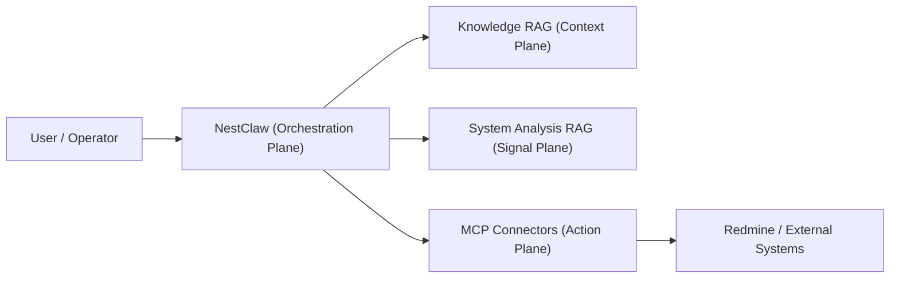

# NestClaw 아이디에이션 1페이지

## 0) 목적 (실행 전 정렬 문서)
- 이 문서는 "지금 당장 개발"이 아니라, 겹쳐진 프로젝트들의 역할 경계를 분리하고 의사결정 기준을 통일하기 위한 아이디에이션 기준서다.
- 목표: **쓸모있는 업무특화 에이전트**를 **보안/조직 운영 가능 형태**로 설계한다.

## 1) 프로젝트 간 역할 경계도


경계 원칙:
- NestClaw: 상태머신, 승인, 정책, 감사로그를 책임진다.
- Knowledge/System RAG: 근거(컨텍스트/신호)를 제공한다. 실행 권한은 없다.
- MCP Connector: 외부 시스템 액션을 수행한다. NestClaw 승인/정책 없이 단독 실행하지 않는다.

## 2) 의사결정 기준표 (Go/No-Go)
| 기준 | 핵심 질문 | Go 기준 | No-Go 조건 | 오너 |
|---|---|---|---|---|
| 업무가치 | 반복 업무를 줄이는가? | MTTA/처리시간 절감이 수치로 설명됨 | 데모성 기능만 있고 운영 가치 불명확 | A01 |
| 실행가능성 | 실제 액션까지 연결되는가? | 문서 생성을 넘어 티켓/작업 반영 가능 | 결과가 보고서로만 끝남 | A02/A03 |
| 보안 | 최소권한/승인 통제가 되는가? | 위험 액션 승인 필수 + 정책 차단 가능 | 폴더/CLI 무제한 권한 전제 | A04 |
| 감사가능성 | 추적이 가능한가? | actor/task/action/evidence 로그 100% | 실행 근거 추적 불가 | A04/A06 |
| 운영성 | 장애 시 복구 가능한가? | 재시도/승인대기/롤백 경로 존재 | 실패 시 수동 임기응변 의존 | A02/A06 |
| 조직적합성 | 팀 프로세스에 붙는가? | Redmine 등 현행 도구와 연계 | 기존 협업 체계와 분리 운영 | A05/A08 |
| 준수성 | 정책/규정 위반 위험이 낮은가? | 데이터 경계/보존 정책 충족 | 민감정보 외부 전송 통제 없음 | A07 |

## 3) 전문가 그룹 검토 요약 (현재 합의)
- A01 Product Owner: 범용 에이전트보다 업무특화형 우선이 타당.
- A02 Workflow Engineer: 실행체인은 이미 존재, 외부 RAG/MCP 어댑터 결합이 다음 과제.
- A03 LLM Orchestrator: planner/executor/reviewer/reporter는 역할이 아니라 "운영 파이프라인"으로 정의해야 모호성 감소.
- A04 Security Privacy: 자동화의 핵심 리스크는 권한 범위. 작업 폴더/CLI 권한은 필요하지만 allowlist + 승인 게이트가 전제.
- A05 UX Operations: 현업은 "무엇을 할 수 있는지"보다 "언제 승인해야 하는지"가 명확해야 채택.
- A06 QA Reliability: 장애 시나리오 기준선(정상/차단/승인대기/실패복구) 없이는 운영 전환 불가.
- A07 Compliance: 액션 로그와 근거 링크 보존 정책이 필요.
- A08 Domain SME: 킬러 컨텐츠는 문서 자동화가 아니라 운영 액션 자동화.

종합 판정:
- **조건부 Go**
- 조건: `업무특화 범위 고정` + `승인/정책/감사 선적용` + `RAG 근거 기반 액션화`

## 4) 아이디에이션 산출물 템플릿 (회의 후 10분 정리용)
```text
[아이디어명]
- 해결할 운영 문제:
- 대상 팀/시스템:
- 기대 효과(정량):
- 필요한 데이터 소스(RAG):
- 필요한 실행 채널(MCP):
- 자동 실행 범위:
- 승인 필수 범위:
- 보안 리스크:
- 실패 시 복구 전략:
- Go/No-Go 판정:
- 다음 검토자(A01~A08):
```

## 5) 지금 단계의 선언
- 지금은 구현 착수 단계가 아니라 **아이디에이션/경계 정렬 단계**다.
- 다음 액션은 개발이 아니라 "후보 시나리오 3개를 동일 기준표로 비교 평가"다.

## 6) 연계 문서
- 후보 시나리오 비교표: `IDEATION_SCENARIO_SCORECARD.md`
- 아이디에이션 전담 전문가 그룹 추천: `IDEATION_EXPERT_SQUAD_RECOMMENDATION.md`
