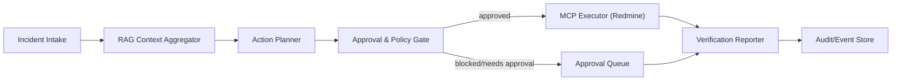

# Stage 8 Detailed Design (2026-03-04)

## 1) 문서 목적
Stage 8(운영장애 대응 오케스트레이션)의 구현 전 상세 설계를 고정한다.
이 문서는 계약(스키마/인터페이스), 실행경로, 승인/정책, QA 게이트를 코드 착수 전에 합의하기 위한 기준이다.

## 2) 설계 원칙
- Contract First: 외부/내부 I/O 스키마를 먼저 고정한다.
- Guardrail First: 고위험 액션은 반드시 승인 경유.
- Evidence First: 모든 액션 카드에 근거 링크를 포함한다.
- Gate First: Dry-run과 회귀 게이트를 통과한 변경만 Sandbox로 이동한다.

## 3) 범위 / 비범위
범위:
- Incident Intake -> RAG Context Aggregation -> Action Planner -> Approval/Policy -> MCP Executor -> Reporter
- Redmine MCP 최소 메서드: `issue.create`, `issue.update`, `issue.add_comment`, `issue.assign`, `issue.transition`
- 품질게이트: 정상/차단/승인대기/실패복구

비범위:
- 다중 ITSM 동시 지원(Jira/ServiceNow 동시 도입)
- 완전자율 복구(승인 없는 고위험 액션 자동 실행)
- 운영 환경 대규모 다서비스 동시 롤아웃

## 4) 목표 아키텍처 상세


## 5) 도메인 계약 (고정)
### 5.1 Incident Intake 객체
```json
{
  "incident_id": "inc_20260304_001",
  "service": "billing-api",
  "severity": "high",
  "detected_at": "2026-03-04T09:00:00Z",
  "source": "alertmanager",
  "summary": "5xx spike and latency regression",
  "time_window": "15m",
  "requested_by": "oncall_01",
  "policy_profile": "prod_strict"
}
```

필수 필드:
- `incident_id`, `service`, `severity`, `detected_at`, `summary`, `requested_by`, `policy_profile`

### 5.2 RAG 계약
Knowledge RAG 요청:
```json
{"query":"billing-api 5xx spike","team":"platform","time_range":"90d"}
```

Knowledge RAG 응답:
```json
{
  "evidence": [
    {
      "source": "runbook://billing/cache",
      "summary": "cache invalidation resolved similar incident",
      "confidence": 0.81,
      "timestamp": "2026-02-20T02:10:00Z"
    }
  ]
}
```

System RAG 요청:
```json
{"incident_id":"inc_20260304_001","service":"billing-api","window":"15m"}
```

System RAG 응답:
```json
{
  "signals": [
    {
      "symptom": "db connection pool saturation",
      "suspected_component": "postgres-primary",
      "confidence": 0.77,
      "evidence_ref": "grafana://dash/123"
    }
  ]
}
```

### 5.3 Action Card 스키마
```json
{
  "action_id": "act_001",
  "incident_id": "inc_20260304_001",
  "title": "Create incident ticket and assign on-call",
  "action_type": "redmine_issue_create",
  "risk_level": "medium",
  "approval_required": false,
  "preconditions": ["incident severity validated"],
  "expected_impact": "ticket lifecycle starts within 1 minute",
  "evidence_links": [
    "runbook://billing/cache",
    "grafana://dash/123"
  ],
  "mcp_call": {
    "method": "issue.create",
    "payload": {
      "project_id": "OPS",
      "subject": "[INCIDENT] billing-api high latency",
      "description": "auto-generated action card",
      "priority": "High"
    }
  }
}
```

필수 필드:
- `action_id`, `incident_id`, `action_type`, `risk_level`, `approval_required`, `evidence_links`, `mcp_call.method`

### 5.4 승인 분류표 (고정)
| Risk Level | 예시 | 기본 정책 | 상태 전이 |
|---|---|---|---|
| `low` | 티켓 코멘트 추가 | 자동 실행 가능 | `RUNNING -> DONE` |
| `medium` | 티켓 생성/담당자 지정 | 자동 실행 가능(근거 필수) | `RUNNING -> DONE` |
| `high` | 서비스 재시작, 설정 변경 | 승인 필수 | `RUNNING -> NEEDS_HUMAN_APPROVAL` |
| `critical` | 데이터 영향/외부 전송/롤백 | 승인 + 2인 검토 권고 | `RUNNING -> NEEDS_HUMAN_APPROVAL` |

추가 규칙:
- `evidence_links`가 비어 있으면 risk 수준과 무관하게 `NEEDS_HUMAN_APPROVAL`
- 정책 위반 패턴 감지 시 즉시 `BLOCKED_POLICY`

## 6) Incident 오케스트레이션 경로 상세
1. `Incident Intake`
2. `planner` 단계에서 RAG 2종 호출 및 컨텍스트 병합
3. `executor` 단계에서 Action Card 리스트 생성
4. 각 Action Card에 대해 승인/정책 게이트 실행
5. 승인 완료 카드만 MCP executor로 전달
6. 결과를 reporter가 `result + remaining_risk + next_action` 포맷으로 출력

실행 의사코드:
```text
ingest_incident()
ctx = aggregate_rag(knowledge_rag, system_rag)
cards = build_action_cards(ctx, policy_profile)
for card in cards:
  gate = evaluate_policy_and_approval(card)
  if gate == BLOCKED_POLICY: log_and_continue()
  elif gate == NEEDS_HUMAN_APPROVAL: enqueue_approval()
  else: execute_mcp(card)
emit_incident_report()
```

## 7) 상태/오류 처리 설계
기존 상태 코드 재사용:
- `READY`, `RUNNING`, `FAILED_RETRYABLE`, `NEEDS_HUMAN_APPROVAL`, `DONE`

에러 처리 규칙:
- RAG timeout: `FAILED_RETRYABLE` 1회
- MCP timeout/network error: `FAILED_RETRYABLE` 1회
- 1회 재시도 실패: `NEEDS_HUMAN_APPROVAL` + 실패 원인 기록
- 정책 위반: `BLOCKED_POLICY` 이벤트 기록 후 해당 액션 스킵

## 8) 보안/감사 설계
- actor identity는 JWT/SSO 기준으로 고정 (`X-Actor-*` 호환은 이관용)
- 모든 MCP 호출에 `actor_id`, `task_id`, `incident_id`, `action_id` 기록
- 민감정보(`secret`, `token`, `password`) 포함 payload는 로그 마스킹
- 감사 조회 시 incident 단위 필터 지원(추후 구현)

## 9) 구현 대상 인터페이스 (파일 레벨)
- `app/incident_rag.py`
  - `fetch_knowledge_evidence(query, team, time_range)`
  - `fetch_system_signals(incident_id, service, window)`
- `app/incident_mcp.py`
  - `execute_redmine_action(method, payload, actor_context)`
- `app/main.py`
  - incident 전용 create/run 경로(기존 task 파이프라인 확장)
  - approval 분기 + action card executor 결합

## 10) QA 설계 (필수 시나리오)
### 10.1 Contract QA
- 문서 계약 섹션 존재 여부
- Action Card 필수 필드 검증
- 승인 분류표 규칙 검증

### 10.2 Dry-run E2E
1. 정상: medium risk action 자동 실행, ticket created 이벤트 확인
2. 차단: 금지 payload 포함 시 `BLOCKED_POLICY` 확인
3. 승인대기: high risk action에서 승인 큐 등록 확인
4. 실패복구: MCP timeout -> 재시도 -> 승인대기 전환 확인

### 10.3 Sandbox E2E
- 테스트 Redmine 프로젝트 대상 lifecycle(생성/갱신/전환/코멘트) 재현
- 승인자/검토자 권한 분리 동작 확인
- 감사로그 추적성(incident-action-event 연결) 검증

## 11) 일정 연계
상세 일정과 운영 체크포인트는 `STAGE8_EXECUTION_CHECKLIST_2026-03-04.md`를 따른다.
